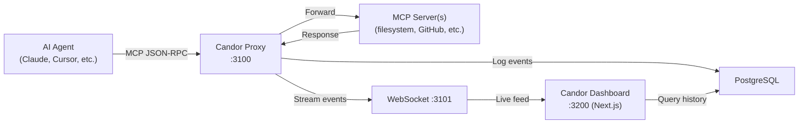

# Candor

> Real-time observability platform that intercepts, logs, and visualizes every action AI agents take — providing full transparency into agentic workflows.

## Overview

Candor is an observability and audit platform for AI agents. As MCP-powered agentic systems become production-critical infrastructure, teams have zero visibility into what their agents actually do — which tools they call, what data they access, how much each action costs, and whether behavior is anomalous or expected.

Candor acts as a transparent proxy layer between AI agents and the MCP servers (or APIs) they interact with. Every request and response is intercepted, logged, and streamed to a real-time dashboard. Think of it as **Sentry for AI agents** — not for catching crashes, but for understanding behavior. Developers debug agent workflows visually, compliance teams export audit trails, and engineering managers track cost attribution across agent pipelines.

The name "Candor" — meaning openness and honest transparency — embodies the core mission: making AI agent behavior visible, understandable, and trustworthy.

**Visual direction:** The Candor brand evokes a clear glass prism refracting light — symbolizing how opaque agent behavior passes through Candor and becomes a visible spectrum of understandable actions. Clean, geometric, with a cool-blue-to-violet gradient palette. The mascot/icon is a stylized prism or lens shape.

## Core Features (MVP)

### 1. MCP Proxy Interceptor
- **What the user sees/does:** Install the Candor proxy as an npm package. Point MCP client connections through `localhost:3100` instead of directly to MCP servers. Zero code changes to existing agents — just a config swap.
- **Behind the scenes:** The proxy intercepts all JSON-RPC 2.0 messages (stdio/SSE), parses tool calls, resources, and prompts, timestamps everything, and forwards traffic to the original MCP server. Results are logged to PostgreSQL and streamed to connected dashboards via WebSocket.

### 2. Live Event Timeline
- **What the user sees/does:** A real-time feed showing every agent action as it happens — tool calls, resource reads, prompt injections, responses. Each event shows: timestamp, tool name, input parameters (redactable), output summary, latency, and estimated token/cost impact.
- **Behind the scenes:** WebSocket connection from the dashboard to the proxy server. Events are structured as typed records and inserted into a time-series table. The timeline supports filtering by agent ID, tool name, time range, and status (success/error).

### 3. Session Explorer
- **What the user sees/does:** Browse historical agent sessions. Click into any session to see the full event chain as a vertical timeline with expandable request/response payloads. See aggregate stats: total tool calls, total cost estimate, error rate, duration.
- **Behind the scenes:** Sessions are demarcated by proxy connection lifecycle. Each session gets a UUID. Events are indexed by session ID for efficient retrieval. Payload data is stored as JSONB.

### 4. Cost Attribution Dashboard
- **What the user sees/does:** A dashboard card showing estimated costs per session, per tool, and per time period. Bar charts and sparklines visualize cost trends. Users can set monthly budget alerts.
- **Behind the scenes:** Token counts are estimated from request/response payload sizes using provider-specific tokenizer approximations. Cost is calculated using configurable rate tables (per-model pricing). Aggregations run as materialized views.

### 5. Alert Rules
- **What the user sees/does:** Define simple alert rules: "Notify me if any single tool call takes > 10s," "Alert if cost exceeds $5/session," "Flag if an agent accesses a tool not on the allowlist." Alerts appear as banners in the dashboard and optionally fire webhooks.
- **Behind the scenes:** Rules are stored in PostgreSQL. The proxy evaluates rules in-process after each event. Matching events trigger alert records and optional webhook POST requests.

## User Flow

1. **Install** — `npm install -g @candor/proxy` (or add as a dev dependency)
2. **Configure** — Update MCP client config to route through `localhost:3100`. Candor proxy config specifies upstream MCP server addresses
3. **Start proxy** — `candor start` launches the proxy and the web dashboard on `localhost:3200`
4. **Use agents normally** — Run any MCP-connected AI workflow (Claude Code, Cursor, custom agents). Traffic flows through Candor transparently
5. **Open dashboard** — Visit `localhost:3200`. See the live timeline populating in real-time as agents work
6. **Explore a session** — Click into a completed session. See the full decision chain, every tool called, every response received
7. **Check costs** — View the cost dashboard. See which tools and sessions are most expensive
8. **Set alerts** — Create a rule: "Flag if `filesystem_write` is called on paths outside `/tmp`"
9. **"Aha" moment** — Developer sees their agent made 47 redundant API calls in one session, costing $3.20 unnecessarily. They now have the data to optimize

## Technical Architecture

- **Platform:** Web application + CLI proxy tool (monorepo)
- **Stack:**
  - **Frontend:** Next.js 16 (App Router)
  - **Backend:** Next.js API routes + standalone Node.js proxy server
  - **Database:** PostgreSQL via Prisma 6
  - **Real-time:** WebSocket (ws library) for live event streaming
  - **Proxy:** Node.js TCP/stdio interceptor for MCP JSON-RPC traffic
  - **Deployment:** Railway (web app + proxy as separate services)

### Data Flow



### Database Schema

```prisma
model Session {
  id          String   @id @default(uuid())
  agentId     String?
  startedAt   DateTime @default(now())
  endedAt     DateTime?
  metadata    Json?
  events      Event[]
  alerts      Alert[]
  totalCostEstimate Float @default(0)
  createdAt   DateTime @default(now())
}

model Event {
  id            String   @id @default(uuid())
  sessionId     String
  session       Session  @relation(fields: [sessionId], references: [id])
  timestamp     DateTime @default(now())
  direction     String   // "request" | "response"
  method        String?  // MCP method name (e.g., "tools/call")
  toolName      String?
  params        Json?    // Request parameters (redactable)
  result        Json?    // Response data
  error         Json?    // Error if any
  latencyMs     Int?
  tokenEstimate Int?
  costEstimate  Float?
  createdAt     DateTime @default(now())

  @@index([sessionId])
  @@index([timestamp])
  @@index([toolName])
}

model AlertRule {
  id          String   @id @default(uuid())
  name        String
  condition   Json     // { field, operator, value }
  webhookUrl  String?
  enabled     Boolean  @default(true)
  alerts      Alert[]
  createdAt   DateTime @default(now())
}

model Alert {
  id          String    @id @default(uuid())
  ruleId      String
  rule        AlertRule @relation(fields: [ruleId], references: [id])
  sessionId   String
  session     Session   @relation(fields: [sessionId], references: [id])
  eventId     String?
  message     String
  acknowledged Boolean @default(false)
  createdAt   DateTime @default(now())
}

model CostRate {
  id        String @id @default(uuid())
  provider  String // "openai" | "anthropic" | "google"
  model     String
  inputPer1kTokens  Float
  outputPer1kTokens Float
  updatedAt DateTime @default(now())
}
```

### API Routes

| Method | Route | Purpose |
|---|---|---|
| GET | `/api/sessions` | List sessions (paginated, filterable) |
| GET | `/api/sessions/[id]` | Get session detail with events |
| GET | `/api/events` | Query events across sessions |
| GET | `/api/stats` | Aggregated cost/usage statistics |
| GET | `/api/alerts` | List triggered alerts |
| POST | `/api/alert-rules` | Create a new alert rule |
| PUT | `/api/alert-rules/[id]` | Update alert rule |
| DELETE | `/api/alert-rules/[id]` | Delete alert rule |
| GET | `/api/cost-rates` | List cost rate configurations |
| PUT | `/api/cost-rates/[id]` | Update a cost rate |
| WS | `/ws` | WebSocket endpoint for live event stream |

### External Service Interaction Points

| Service | Interaction | Purpose |
|---|---|---|
| MCP Servers | JSON-RPC proxy passthrough | Core interception — all MCP traffic flows through Candor |
| Webhook endpoints | HTTP POST | Deliver alert notifications to user-configured URLs |

## Pages / Screens

### 1. Dashboard (Home)
- **Purpose:** At-a-glance overview of agent activity
- **Key UI elements:**
  - Live event counter (events/minute sparkline)
  - Active sessions indicator
  - Today's estimated cost (card with trend arrow)
  - Recent alerts banner
  - Quick stats: total sessions, total events, avg session duration
- **Data source:** `/api/stats`, WebSocket live feed

### 2. Live Timeline
- **Purpose:** Real-time feed of all agent actions as they happen
- **Key UI elements:**
  - Vertically scrolling event cards with auto-scroll
  - Each card: timestamp, agent ID badge, tool name chip, direction arrow (→/←), latency, cost estimate
  - Filter bar: by agent, tool, status, time range
  - Pause/resume live feed button
- **Data source:** WebSocket `/ws`, `/api/events` for historical scroll-back

### 3. Session Explorer
- **Purpose:** Browse and inspect completed sessions
- **Key UI elements:**
  - Session list table: ID, agent, start time, duration, event count, total cost, error count
  - Click-to-expand detail: vertical timeline of events with collapsible JSON payloads
  - Session summary header: aggregate stats card
- **Data source:** `/api/sessions`, `/api/sessions/[id]`

### 4. Cost Dashboard
- **Purpose:** Track and forecast agent-related costs
- **Key UI elements:**
  - Cost over time (bar chart, daily/weekly/monthly toggle)
  - Cost by tool (horizontal bar chart)
  - Cost by agent (pie chart)
  - Monthly budget progress bar with alert threshold marker
  - Cost rate configuration table (editable)
- **Data source:** `/api/stats`, `/api/cost-rates`

### 5. Alerts
- **Purpose:** Manage alert rules and review triggered alerts
- **Key UI elements:**
  - Alert rules table with enable/disable toggles
  - "Create Rule" modal: condition builder (field → operator → value), optional webhook URL
  - Triggered alerts feed: message, timestamp, linked session, acknowledge button
- **Data source:** `/api/alert-rules`, `/api/alerts`

### 6. Settings
- **Purpose:** Configure proxy and dashboard preferences
- **Key UI elements:**
  - Proxy connection status indicator
  - Upstream MCP server list (from proxy config, read-only display)
  - Data retention setting (days to keep events)
  - Redaction patterns (regex patterns to mask sensitive data in payload logs)
  - Theme toggle (dark/light)
- **Data source:** Local config file, `/api/settings`

## API & Data Sources

### MCP JSON-RPC Traffic (Primary)
- **Endpoint:** Local proxy intercept (not an external API, but the core data source)
- **Data provided:** All tool calls, resource reads, prompt completions, and errors flowing between agents and MCP servers
- **Rate limits:** N/A (local traffic)
- **Fallback:** Proxy runs in passthrough mode if logging fails — agent workflow is never blocked

### Token Cost Estimation
- **Method:** Payload size → approximate token count using tiktoken-compatible estimation
- **Data:** Pre-configured rate tables (user-editable) for OpenAI, Anthropic, Google models
- **Fallback:** Shows "cost unknown" if model can't be identified; user can manually set rates

### Webhook Delivery (Alerts)
- **Endpoint:** User-configured URL
- **Method:** HTTP POST with JSON payload `{ alert, session, event }`
- **Rate limits:** Max 1 webhook per alert rule per 60s (debounced)
- **Fallback:** Alert still logged in dashboard if webhook delivery fails

## Out of Scope (v1)

- **Cloud-hosted SaaS version** — v1 is fully local / self-hosted only
- **Multi-user / team features** — No auth, permissions, or shared workspaces
- **Direct LLM API interception** — v1 intercepts MCP traffic only, not raw OpenAI/Anthropic API calls
- **AI-powered anomaly detection** — Alerts are rule-based only; no ML-based pattern detection
- **VS Code extension** — Future enhancement; v1 is browser dashboard only
- **Mobile responsive design** — Dashboard is desktop-optimized
- **SSO / OAuth integration** — Local-only, no auth needed
- **Data export to external analytics** — No Datadog/Grafana integrations in v1
- **Replay / time-travel debugging** — v1 shows history but can't replay sessions
- **Custom MCP server marketplace** — Out of scope entirely
